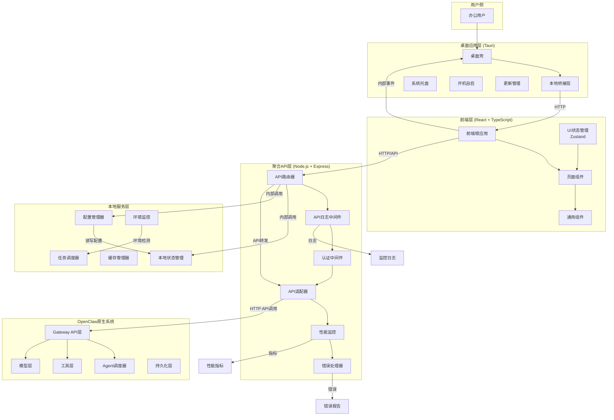

# 办公增强控制台技术架构方案书
> 第二阶段架构收敛 - 完整技术架构设计

## 1. 架构愿景与原则

### 1.1 架构愿景
构建一个**独立、可演进、易于维护**的办公增强控制台，为用户提供**直观、稳定、可观测**的OpenClaw体验。

### 1.2 核心架构原则

1. **分离关注点**
   - UI层专注用户体验和交互逻辑
   - 聚合层专注API适配和业务聚合
   - 桌面层专注系统集成和部署

2. **渐进增强**
   - 从MVP开始，逐步丰富功能
   - 技术架构支持分阶段演进
   - 优先解决核心用户痛点

3. **监控先行**
   - 从第一行代码就要考虑可观测性
   - 建立完整的监控和日志体系
   - 支持快速问题诊断和修复

4. **配置驱动**
   - 关键参数可配置，支持不同部署场景
   - 降低部署和维护成本
   - 支持本地开发和测试环境

## 2. 整体架构图



## 3. 分层架构详述

### 3.1 桌面应用层 (Tauri)

**架构目标**：
- 提供Windows原生应用体验
- 管理应用生命周期
- 实现系统级集成

**核心组件**：
```
Tauri App (Cargo.toml)
├── src-tauri/
│   ├── main.rs (Rust主入口)
│   ├── build.rs (构建配置)
│   ├── commands.rs (Rust命令定义)
│   ├── system.rs (系统级操作)
│   └── config/
│       └── tauri.conf.json (Tauri配置)
└── src/ (前端代码)
```

**关键能力**：
1. **应用窗口管理**
   - 主窗口创建和配置
   - 菜单栏和系统托盘
   - 多窗口支持（可选）

2. **系统集成**
   - 开机自启配置
   - 系统通知集成
   - 文件关联注册

3. **更新管理**
   - 自动更新检测
   - 安装包下载和安装
   - 回滚机制

4. **安全加固**
   - 权限控制
   - 资源访问限制
   - 安全沙箱配置

### 3.2 前端层 (React + TypeScript)

**架构目标**：
- 提供优秀的用户体验
- 支持快速迭代和开发
- 确保可维护性和可测试性

**技术栈选择**：
```javascript
// 核心依赖
{
  "@types/react": "^18.x",
  "@types/react-dom": "^18.x",
  "react": "^18.x",
  "react-dom": "^18.x",
  "react-router-dom": "^6.x",
  
  // 样式
  "tailwindcss": "^3.x",
  "@headlessui/react": "^1.x",
  
  // 状态管理  
  "zustand": "^4.x",
  
  // 数据获取
  "axios": "^1.x",
  
  // 开发工具
  "typescript": "^5.x",
  "vite": "^5.x"
}
```

**架构设计**：

#### 3.2.1 项目结构
```
src/
├── api/            # API客户端和类型定义
│   ├── client.ts   # Axios配置和拦截器
│   ├── types/      # API类型定义
│   └── services/   # API服务层
│
├── components/     # 可复用UI组件
│   ├── common/     # 通用组件（按钮、输入框等）
│   ├── layout/     # 布局组件
│   └── features/   # 特性组件（任务卡片、Agent卡片等）
│
├── pages/         # 页面组件
│   ├── Home/      # 首页
│   ├── Agents/    # Agent中心
│   ├── Tasks/     # 任务中心
│   └── Settings/  # 配置中心
│
├── stores/        # Zustand状态存储
│   ├── app.store.ts     # 应用级状态
│   ├── agents.store.ts  # Agent状态
│   ├── tasks.store.ts   # 任务状态
│   └── config.store.ts  # 配置状态
│
├── hooks/         # 自定义React Hooks
│   ├── useApi.ts         # API调用封装
│   ├── useWebSocket.ts   # WebSocket管理
│   └── useLocalStorage.ts # 本地存储
│
├── utils/         # 工具函数
│   ├── formatters.ts     # 数据格式化
│   ├── validators.ts     # 数据验证
│   └── helpers.ts        # 辅助函数
│
├── assets/        # 静态资源
├── styles/        # 全局样式
└── App.tsx        # 应用入口
```

#### 3.2.2 状态管理策略

**采用Zustand的理由**：
1. **轻量级**：相比Redux，无需复杂模板代码
2. **模块化**：可按功能模块创建独立store
3. **TypeScript友好**：完整类型支持
4. **响应式**：支持订阅特定状态变化

**Store设计模式**：
```typescript
// agents.store.ts示例
import { create } from 'zustand'

interface Agent {
  id: string
  name: string
  status: 'available' | 'running' | 'needs_config' | 'failed'
}

interface AgentsStore {
  // 状态
  agents: Agent[]
  loading: boolean
  error: string | null
  
  // 动作
  fetchAgents: () => Promise<void>
  startAgent: (agentId: string) => Promise<void>
  toggleAgent: (agentId: string, enabled: boolean) => Promise<void>
  
  // 派生状态
  getAvailableAgents: () => Agent[]
  getAgentById: (id: string) => Agent | undefined
}

const useAgentsStore = create<AgentsStore>((set, get) => ({
  agents: [],
  loading: false,
  error: null,
  
  fetchAgents: async () => {
    set({ loading: true, error: null })
    try {
      const response = await agentsApi.list()
      set({ agents: response.data, loading: false })
    } catch (error) {
      set({ error: error.message, loading: false })
    }
  },
  
  // ...其他动作
}))
```

### 3.3 聚合API层 (Node.js + Express)

**架构目标**：
- 作为前端和OpenClaw系统的中间层
- 提供统一、稳定的API接口
- 实现核心业务逻辑和聚合功能

**技术栈选择**：
```javascript
{
  "express": "^4.x",
  "cors": "^2.x",
  "helmet": "^7.x",      // 安全头
  "compression": "^1.x", // 压缩
  "winston": "^3.x",     // 结构化日志
  "express-rate-limit": "^7.x", // 限流
  
  // API适配
  "axios": "^1.x",       // OpenClaw API调用
  "joi": "^17.x",        // 请求验证
  
  // 监控
  "express-prom-bundle": "^7.x", // Prometheus指标
  "express-status-monitor": "^2.x", // 状态监控
  
  // 配置
  "dotenv": "^16.x",
  "config": "^3.x"
}
```

#### 3.3.1 应用结构
```
src/
├── controllers/     # 控制器层
│   ├── api.controller.ts       # 聚合API控制器
│   ├── agents.controller.ts    # Agent相关
│   ├── tasks.controller.ts     # 任务相关
│   └── config.controller.ts    # 配置相关
│
├── services/       # 服务层（业务逻辑）
│   ├── openclaw.service.ts   # OpenClaw API调用
│   ├── agents.service.ts     # Agent业务逻辑
│   ├── cache.service.ts      # 缓存管理
│   └── aggregation.service.ts # 数据聚合
│
├── routes/        # 路由定义
│   ├── api.router.ts         # v1路由集合
│   ├── health.router.ts      # 健康检查
│   └── metrics.router.ts     # 监控指标
│
├── middleware/    # 中间件
│   ├── auth.middleware.ts    # 认证
│   ├── logger.middleware.ts  # 日志
│   ├── validation.middleware.ts # 验证
│   └── error.middleware.ts   # 错误处理
│
├── utils/         # 工具函数
│   ├── logger.ts       # 日志工具
│   ├── formatters.ts   # 数据格式化
│   └── validators.ts   # 验证工具
│
├── models/        # 数据模型
│   ├── request.models.ts     # 请求DTO
│   └── response.models.ts    # 响应DTO
│
├── config/        # 配置管理
│   └── index.ts
│
├── app.ts         # Express应用
└── server.ts      # 服务器入口
```

#### 3.3.2 核心中间件栈
```typescript
// app.ts配置示例
import express from 'express'
import cors from 'cors'
import helmet from 'helmet'
import compression from 'compression'
import rateLimit from 'express-rate-limit'

const app = express()

// 基础中间件
app.use(helmet()) // 安全头
app.use(cors({ origin: true })) // CORS
app.use(compression()) // 响应压缩
app.use(express.json()) // JSON解析

// 限流（可根据需要调整）
const apiLimiter = rateLimit({
  windowMs: 15 * 60 * 1000, // 15分钟
  max: 100, // 每个IP限制100个请求
  message: '请求过于频繁，请稍后再试'
})
app.use('/api/', apiLimiter)

// 自定义中间件
app.use(loggerMiddleware) // 访问日志
app.use(authMiddleware)   // 认证验证
app.use(validationMiddleware) // 请求验证

// 路由
app.use('/api', apiRouter)
app.use('/health', healthRouter)
app.use('/metrics', metricsRouter)

// 错误处理中间件（必须在最后）
app.use(errorMiddleware)
```

#### 3.3.3 OpenClaw适配器设计
```typescript
// openclaw.service.ts 示例
export class OpenClawService {
  private openClawBaseURL: string
  private openClawToken: string
  
  constructor() {
    this.openClawBaseURL = config.get('openclaw.url')
    this.openClawToken = config.get('openclaw.token')
  }
  
  // 统一请求方法
  private async request<T>(
    method: string,
    path: string,
    data?: any
  ): Promise<T> {
    const url = `${this.openClawBaseURL}${path}`
    const headers = {
      'Authorization': `Bearer ${this.openClawToken}`,
      'Content-Type': 'application/json'
    }
    
    try {
      const response = await axios.request<T>({
        method,
        url,
        headers,
        data,
        timeout: 10000 // 10秒超时
      })
      return response.data
    } catch (error) {
      // 统一处理OpenClaw错误
      throw this.normalizeOpenClawError(error)
    }
  }
  
  // 具体服务方法
  async getAgents(): Promise<Agent[]> {
    return this.request<Agent[]>('GET', '/api/agents')
  }
  
  async startAgent(agentId: string, input: any): Promise<TaskResponse> {
    return this.request<TaskResponse>(
      'POST', 
      `/api/agents/${agentId}/run`, 
      { input }
    )
  }
  
  async getTask(taskId: string): Promise<Task> {
    return this.request<Task>('GET', `/api/tasks/${taskId}`)
  }
  
  // 错误标准化
  private normalizeOpenClawError(error: any): Error {
    if (error.response) {
      const { status, data } = error.response
      return new Error(
        `OpenClaw API错误 (${status}): ${JSON.stringify(data)}`
      )
    }
    if (error.request) {
      return new Error('OpenClaw连接失败，请检查网络连接')
    }
    return error
  }
}
```

### 3.4 本地服务层

**核心能力模块**：

#### 3.4.1 配置管理器 (ConfigManager)
```typescript
interface ConfigManager {
  // 配置加载和保存
  loadConfig(): Promise<AppConfig>
  saveConfig(config: Partial<AppConfig>): Promise<void>
  
  // 配置合并和冲突解决
  mergeWithOpenClaw(openClawConfig: any): AppConfig
  
  // 配置版本管理
  getConfigVersion(): string
}
```

#### 3.4.2 本地状态管理 (LocalState)
```typescript
interface LocalStateManager {
  // UI状态持久化
  saveUIState(state: UIState): void
  loadUIState(): UIState | null
  
  // 离线任务队列
  enqueueOfflineTask(task: Task): void
  dequeueTasks(): Task[]
  
  // 缓存管理
  getCached<T>(key: string): T | null
  setCached<T>(key: string, value: T, ttl: number): void
}
```

#### 3.4.3 环境监控 (EnvMonitor)
```typescript
interface EnvMonitor {
  // 环境检测
  checkRequirements(): Promise<EnvCheckResult[]>
  
  // 性能监控
  monitorSystemPerformance(): SystemMetrics
  
  // 错误检测
  detectErrors(): Error[]
  
  // 自动修复建议
  suggestFixes(): FixSuggestion[]
}
```

## 4. API层设计草案

### 4.1 API版本策略
```
/api/v1/...   # 当前稳定版本（MVP）
/api/dev/...  # 开发中版本（供开发环境使用）
```

### 4.2 API端点设计

#### 首页相关API
```yaml
GET /api/v1/summary:
  description: 获取首页摘要数据（聚合多个接口）
  response:
    status: object
    console_agent_suggestions: object
    current_tasks: array
    recent_results: array
    problems_detected: array

GET /api/v1/console-agent/suggestions:
  description: 获取Console Agent建议
  response:
    current_summary: string
    problems: array
    recommended_next_step: object
    updates: array
```

#### Agent相关API
```yaml
GET /api/v1/agents:
  description: 获取Agent列表
  query_params:
    status: string (可选，过滤状态)
    category: string (可选，过滤类别)
  response:
    agents: array

POST /api/v1/agents/{agent_id}/run:
  description: 启动Agent任务
  request_body:
    input: object (Agent特定输入)
    options: object (执行选项，如超时时间)
  response:
    task_id: string
    status: string
    estimated_duration: number (可选)
```

#### 任务相关API
```yaml
GET /api/v1/tasks:
  description: 获取任务列表
  query_params:
    status: string (可选)
    limit: number (可选，默认50)
    offset: number (可选，默认0)
  response:
    tasks: array
    total_count: number

GET /api/v1/tasks/current:
  description: 获取当前正在运行的任务
  response:
    tasks: array

GET /api/v1/tasks/{task_id}:
  description: 获取任务详情
  query_params:
    include_logs: boolean (可选，是否包含详细日志)
  response:
    task: object
    steps: array
    logs: array (if include_logs=true)
    result_data: object (如任务完成)
```

#### 配置相关API
```yaml
GET /api/v1/config/summary:
  description: 获取配置摘要
  response:
    model_config: object
    feishu_config: object
    workspace_config: object
    openclaw_config: object

POST /api/v1/config/test:
  description: 测试特定配置
  request_body:
    type: string (model, feishu, browser, workspace)
    config: object (要测试的配置)
  response:
    success: boolean
    message: string
    details: object
```

#### 监控和诊断API
```yaml
GET /api/v1/health:
  description: 系统健康检查
  response:
    status: string (up|degraded|down)
    components: array
    version: string
    uptime_seconds: number

GET /api/v1/diagnostics/errors:
  description: 获取错误列表
  query_params:
    level: string (可选，error级别过滤)
    limit: number (可选)
  response:
    errors: array

GET /api/v1/metrics:
  description: 获取性能指标 (Prometheus格式)
```

### 4.3 WebSocket接口设计

```typescript
// WebSocket消息格式
interface WebSocketMessage {
  type: 'task_status_update' | 'agent_status_update' | 'error_notification'
  timestamp: string
  payload: any
}

// 订阅接口
WS /ws/v1/events
// 建立连接后，发送订阅消息
{
  "action": "subscribe",
  "channels": ["tasks", "agents", "errors"]
}

// 服务器推送示例
{
  "type": "task_status_update",
  "timestamp": "2026-03-13T10:30:00Z",
  "payload": {
    "task_id": "task_001",
    "new_status": "running",
    "current_step": "生成章节结构"
  }
}
```

## 5. 技术选型比较

### 5.1 前端技术选型

| 技术栈选项 | 优点 | 缺点 | 推荐度 |
|-----------|------|------|--------|
| **React + TypeScript** | 生态丰富、社区活跃、TypeScript强类型、招聘容易 | 相对复杂、需要配置较多工具 | ★★★★★ |
| **Vue 3 + TypeScript** | 渐进式、轻量级、组合式API | 生态相对较弱、企业采用相对较少 | ★★★★☆ |
| **Svelte** | 编译时优化、体积小、性能好 | 生态不够成熟、企业采用较少 | ★★★☆☆ |

**最终选择：React + TypeScript**
- 符合团队技术栈偏好
- 丰富生态支持
- TypeScript提供完整类型安全

### 5.2 状态管理方案

| 方案 | 优点 | 缺点 | 推荐度 |
|------|------|------|--------|
| **Zustand** | 轻量、简单、TypeScript友好、无模板代码 | 功能相对基础、依赖模式简单 | ★★★★★ |
| **Redux Toolkit** | 企业级、生态丰富、成熟稳定 | 模板代码多、学习曲线陡 | ★★★☆☆ |
| **Valtio** | 响应式、简单直观 | 不够成熟、生态较弱 | ★★★☆☆ |
| **Recoil** | React官方实验库、原子化设计 | 仍处于实验阶段、API不稳定 | ★★☆☆☆ |

**最终选择：Zustand**
- 符合MVP快速原型需求
- 简化状态管理复杂度
- 良好的TypeScript支持

### 5.3 桌面框架选型

| 方案 | 优点 | 缺点 | 推荐度 |
|------|------|------|--------|
| **Tauri** | 基于Rust、性能好、包体积小、安全性高 | 相对较新、生态正在发展中 | ★★★★★ |
| **Electron** | 生态成熟、社区活跃、文档丰富 | 内存占用高、包体积大 | ★★★★☆ |
| **Flutter Desktop** | 跨平台一致性好、性能好 | 桌面生态弱、Flutter web渲染问题 | ★★☆☆☆ |

**最终选择：Tauri**
- 符合项目性能要求
- Rust提供更好的安全性和性能
- 包体积优化好

### 5.4 后端API框架

| 方案 | 优点 | 缺点 | 推荐度 |
|------|------|------|--------|
| **Express** | 生态成熟、简单直接、中间件丰富 | 需要手动组装很多东西、需要更多配置 | ★★★★★ |
| **Fastify** | 性能好、自带TypeScript支持、Schema验证 | 生态相对Express略弱 | ★★★★☆ |
| **NestJS** | 企业级、Angular风格、依赖注入完善 | 学习曲线陡、相对重量级 | ★★★☆☆ |

**最终选择：Express**
- 团队熟悉度高
- 生态丰富，易于找到解决方案
- 灵活性强，适合MVP快速迭代

## 6. 后续并回原后台的迁移策略

### 6.1 模块化迁移原则

**指导思想**：办公增强控制台作为独立产品演进，但考虑未来可能与OpenClaw系统进一步集成。

#### 6.1.1 可迁移模块识别

| 模块 | 迁移可能性 | 迁移时机 | 迁移策略 |
|------|-----------|----------|----------|
| **Console Agent建议引擎** | 高 | 经验证稳定后 | 作为独立组件，可用于不同前端 |
| **配置同步机制** | 高 | 用户需求明确时 | 重构为微服务，多个前端共享 |
| **Agent管理界面** | 中 | OpenClaw需要办公界面时 | 抽出业务逻辑，保留适配层 |
| **任务跟踪界面** | 中 | OpenClaw需要增强任务可视化时 | 组件化设计，可嵌入不同UI |
| **错误诊断系统** | 高 | 具备通用价值时 | 独立服务，多个客户端可消费 |

#### 6.1.2 技术架构设计原则（支持迁移）

1. **清晰的边界**：模块之间有明确定义的接口
2. **独立部署能力**：关键模块可独立打包部署
3. **依赖注入**：通过配置决定依赖，支持环境切换
4. **配置驱动**：切换为不同环境时通过配置控制

### 6.2 迁移路径规划

#### 阶段一：架构准备期（当前）
- **目标**：设计支持未来迁移的架构
- **关键决策**：
  - API层设计为独立服务，而非前端代码的一部分
  - 业务逻辑主要放在服务端，而非前端
  - 数据库访问通过服务代理，而非直接访问

#### 阶段二：独立运行期（MVP阶段）
- **目标**：作为独立产品稳定运行
- **强调**：
  - 产品完整性
  - 用户体验
  - 运行稳定性
- **技术架构**：完整的独立架构

#### 阶段三：能力沉淀期（产品验证后）
- **目标**：验证的技术方案和经验沉淀
- **行动**：
  - 识别通用组件和模块
  - 重构为可独立部署的服务
  - 建立API服务注册机制
  - 制定模块标准接口规范

#### 阶段四：集成和迁移（需要时）
- **目标**：将验证的组件/服务集成回OpenClaw
- **策略**：
  - 渐进式迁移，不影响现有功能
  - 并行运行，逐步切换
  - 用户无感知切换

### 6.3 架构演进建议

#### 短期建议（MVP阶段）
1. **保持架构灵活性**：但优先满足MVP交付
2. **代码组织规范**：为后续拆分做准备
3. **监控和文档**：积累运行数据和实施经验

#### 中期建议（产品验证阶段）
1. **识别核心资产**：找到真正有价值、可复用的部分
2. **规划技术债务**：制定重构计划
3. **评估集成需求**：根据实际用户需求决定集成深度

#### 长期建议（企业部署阶段）
1. **微服务化准备**：将聚合API层拆分为更细的服务
2. **跨产品集成**：考虑与其他产品的集成需求
3. **平台化演进**：从产品向平台演进，支持插件化

## 7. 风险与应对策略

### 7.1 技术风险

| 风险项 | 可能性 | 影响 | 应对策略 |
|--------|--------|------|----------|
| **OpenClaw API变更频繁** | 高 | 高 | 建立API适配层、定期沟通机制、版本兼容策略 |
| **Tauri稳定性问题** | 中 | 中 | 准备Electron备选方案、参与Tauri社区 |
| **聚合层性能瓶颈** | 低 | 中 | 性能监控早期建立、缓存策略、可水平扩展设计 |
| **跨域认证复杂性** | 中 | 中 | MVP简化认证、设计演进路径、技术原型验证 |
| **实时数据同步问题** | 中 | 中 | 轮询降级机制、连接状态监控、客户端队列缓冲 |

### 7.2 项目管理风险

| 风险项 | 可能性 | 影响 | 应对策略 |
|--------|--------|------|----------|
| **需求范围蔓延** | 高 | 高 | 严格执行MVP范围、定期回顾优先级 |
| **团队协作效率** | 中 | 中 | 清晰的接口定义、自动化测试、持续集成 |
| **技术债务累积** | 中 | 高 | 定期技术债务评估、重构计划 |
| **部署复杂度增加** | 中 | 中 | 标准化部署脚本、环境配置管理 |

### 7.3 实施风险缓解措施

1. **分阶段实施**：严格按阶段推进，每阶段有明确产出
2. **持续验证**：定期进行技术验证和原型测试
3. **早期用户反馈**：尽早获取真实用户反馈
4. **监控预警**：建立全面的运行监控系统
5. **文档同步**：架构决策和变更同步记录

## 8. 实施时间规划建议

### 8.1 第一阶段：核心架构搭建（2-3周）
**目标**：建立可运行的基础架构
- 聚合API层基础框架
- 前端基础项目结构
- Tauri应用骨架
- 本地部署环境

### 8.2 第二阶段：核心功能实现（3-4周）
**目标**：实现MVP核心功能
- 配置管理（模型、飞书）
- Agent列表和状态展示
- 任务启动和状态跟踪
- 基础错误展示

### 8.3 第三阶段：用户体验优化（2-3周）
**目标**：提升产品可用性
- Console Agent建议引擎
- 首页状态聚合
- 错误处理和诊断
- 性能优化和监控

### 8.4 第四阶段：产品优化和发布（1-2周）
**目标**：准备产品发布
- 打包和分发准备
- 文档编写
- 最终测试和优化
- 发布准备

## 9. 结论与建议

### 9.1 架构决策总结

1. **核心决策**：
   - 采用独立聚合API层架构，保持与OpenClaw的技术解耦
   - 选择轻量级技术栈（React + Zustand + Tauri + Express），降低复杂性和风险
   - 实施渐进增强策略，从MVP开始，逐步演进

2. **关键技术选择**：
   - **前端**：React + TypeScript + TailwindCSS
   - **状态管理**：Zustand（轻量、简单、TypeScript友好）
   - **桌面框架**：Tauri（性能好、安全性高）
   - **后端**：Node.js + Express（生态丰富、团队熟悉）

3. **关键架构模式**：
   - API适配层模式（隔离OpenClaw变化）
   - 分层架构模式（桌面、前端、服务层分离）
   - 渐进增强模式（从透明代理到智能聚合）

### 9.2 核心建议

#### 立即实施建议：
1. **立刻启动**：核心架构原型验证（API层、前端基础、Tauri集成）
2. **优先验证**：OpenClaw API的可用性和稳定性
3. **建立基础**：项目基础设施（代码库、CI/CD、文档）

#### 风险控制建议：
1. **保持沟通**：与OpenClaw团队建立定期技术对齐机制
2. **监控先行**：从Day 1就要建立运行监控机制
3. **用户优先**：持续关注办公用户的实际使用体验和痛点

#### 技术管理建议：
1. **保持文档同步**：架构决策和变更要有清晰记录
2. **建立技术评审**：关键技术决策需要评审机制
3. **代码质量保障**：尽早建立代码规范和测试机制

### 9.3 成功标准衡量

**技术成功标准**：
1. 基础架构运行稳定，无明显性能瓶颈
2. API层能够有效隔离OpenClaw变化
3. 实时数据同步可靠，延迟可接受
4. 监控系统能及时发现和定位问题

**产品成功标准**：
1. 办公用户能够独立完成配置和基础任务
2. 状态查看和错误诊断更加直观
3. Console Agent建议有帮助且准确
4. 整体产品体验优于直接使用OpenClaw后台

---
*方案版本：V1.0*
*更新时间：2026-03-13*
*更新人：Architect-Jax*
*状态：已完成详细架构设计，待评审和实施*